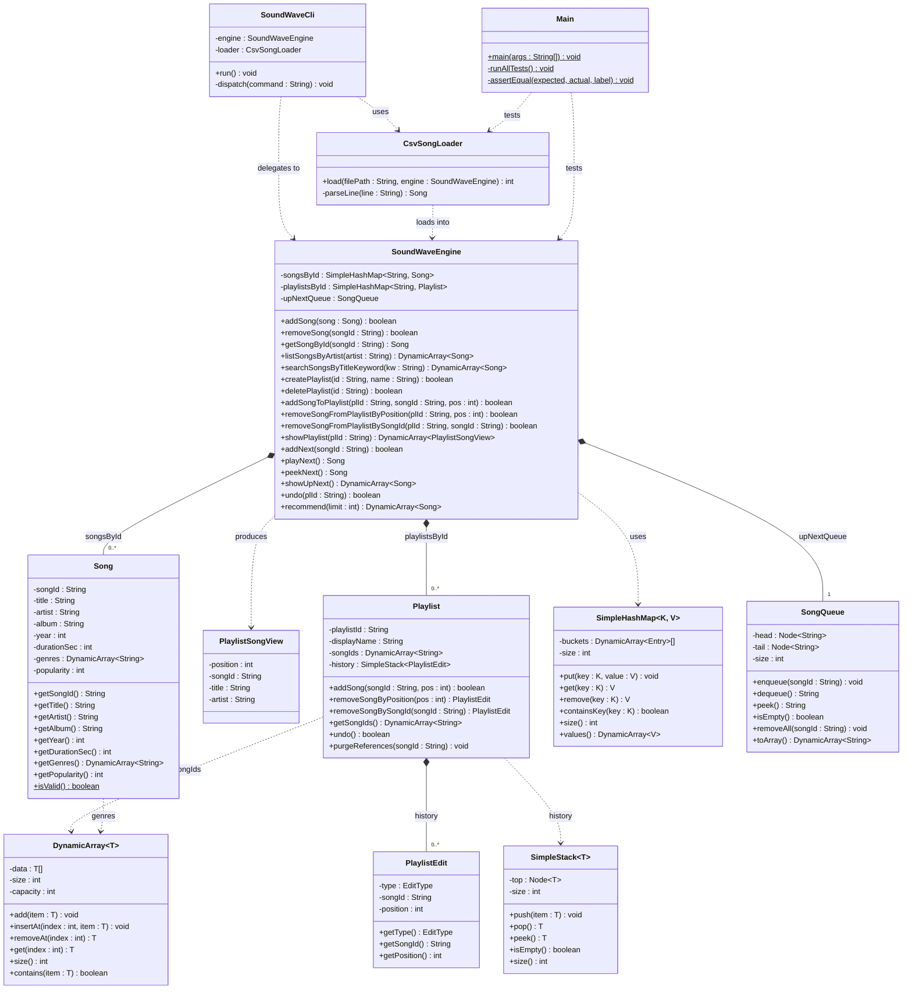

# SoundWave Design Document

## 1) Class / Module Plan

- `Song`
  - Immutable song model with required fields and validation helper.
- `SoundWaveEngine`
  - Main backend API implementing all required operations.
  - Owns library, playlists, queue, and recommendation logic.
- `Playlist`
  - Ordered song IDs plus per-playlist undo stack.
  - Handles add/remove/undo behavior.
- `CsvSongLoader`
  - CSV parsing and import into `SoundWaveEngine`.
- `SoundWaveCli`
  - Command parser/dispatcher for required CLI commands.
- `Main`
  - Automated path-testing harness (and optional CLI entry mode).

### Custom Data Structures (no built-in collections)
- `DynamicArray<T>`: resizable array for ordered collections.
- `SimpleHashMap<K,V>`: separate-chaining hash table.
- `SimpleStack<T>`: linked-list stack (undo history).
- `SongQueue`: linked-list FIFO queue (up-next line).

## 2) UML-Style Relationship Overview

- `SoundWaveEngine`
  - has `SimpleHashMap<String, Song>` (library)
  - has `SimpleHashMap<String, Playlist>` (playlists)
  - has `SongQueue` (up-next)
- `Playlist`
  - has `DynamicArray<String>` (ordered song IDs)
  - has `SimpleStack<PlaylistEdit>` (undo history)
- `PlaylistEdit`
  - stores operation type + songId + position
- `SoundWaveCli`
  - depends on `SoundWaveEngine` + `CsvSongLoader`
- `Main`
  - executes tests against `SoundWaveEngine` / `CsvSongLoader`



## 3) Internal Design Choices and Rationale

- **Song storage**: hash map keyed by `songId`.
  - O(1) expected lookups/inserts/removals.
- **Playlist storage**: hash map keyed by `playlistId`.
  - O(1) expected create/delete/find.
- **Playlist order**: dynamic array of `songId`.
  - O(1) append; O(n) insert/remove in middle due shifting.
  - Matches required ordered behavior.
- **Up-next queue**: linked FIFO queue.
  - O(1) enqueue/dequeue/peek.
- **Undo**: per-playlist stack of edits.
  - O(1) push/pop for undoable playlist operations.
  - Per-playlist isolation simplifies correctness and scope.

### Policy Decisions
- Playlist duplicates: **allowed**.
- Remove-by-songId: removes **first occurrence**.
- Unknown year representation: `-1`.
- Malformed CSV lines: **skip with warning-level behavior** (counted as skipped).
- Remove-song side effect policy:
  - remove from library by exact `songId`
  - remove **all occurrences** from every playlist
  - remove **all occurrences** from up-next queue
  - purge undo history entries referencing removed song IDs

### Query Normalization Rules
- `LISTARTIST`: trimmed, case-insensitive exact match.
- `SEARCHTITLE`: lowercased; non-alphanumeric characters normalized to spaces; repeated spaces collapsed; substring match.

## 4) Complexity Expectations

- `addSong`: O(1) expected
- `removeSong`: O(P + total playlist entries + Q) worst-case scan for side-effects
- `getSongById`: O(1) expected
- `listSongsByArtist`: O(S)
- `searchSongsByTitleKeyword`: O(S * T) (T = title normalization/contains cost)
- `createPlaylist` / `deletePlaylist`: O(1) expected
- `addSongToPlaylist`:
  - append O(1) amortized
  - positioned insert O(n) for shift
- `removeSongFromPlaylistByPosition`: O(n)
- `removeSongFromPlaylistBySongId`: O(n)
- `showPlaylist`: O(n)
- `addNext` / `playNext` / `peekNext`: O(1)
- `showUpNext`: O(Q)
- `undo`: O(1) expected per step
- `recommend(k)`: O(S^2) with insertion sort in current implementation

## 5) Testing Strategy (Main.java)

`Main.java` automatically executes path-based tests with PASS/FAIL summary and detailed failure diagnostics.

Coverage includes:
- All required success/failure branches for library operations.
- Playlist creation/deletion/add/remove/show including boundary positions and duplicate policy behavior.
- Up-next queue success/failure/empty-state behavior.
- Undo success/no-history/missing-playlist/multi-step/20+ steps.
- Cross-component side effects (song removal updates playlists and queue).
- CSV load success and malformed/failure paths.

The test harness is deterministic and executable with one command:
```bash
java -cp src Main
```
